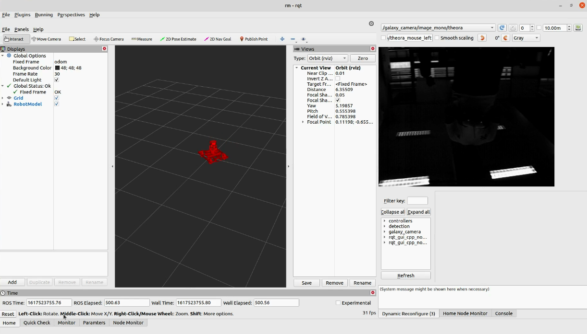
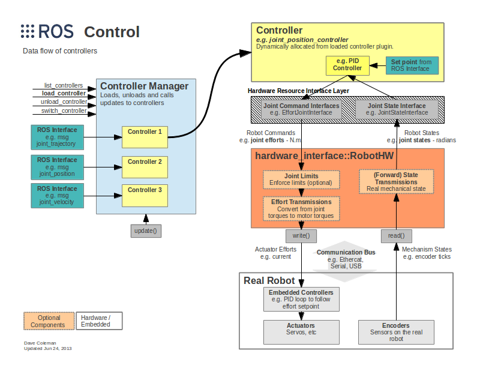

# rc_start_lesson

## **前言**

Why we change?

由于学院几年的单片机控制开发遇到了各种各样的瓶颈，我们在今年重组了控制组，引入ROS机器人操作系统作为控制组开发的主要方向：

优点如下：

1. 调试界面简单直观

2. 能够在机械没出车的情况下完成代码的初调

3. 可以根据不同的硬件开发不同的硬件接口，而且硬件驱动只要写一次，便可以通过简单的配置文件使用对应的硬件

4. 代码的复用性极强，控制组的同学可以把更多的精力放在开发新技术上，而不是像单片机一样重新实现旧的功能。

我们使用的代码框架：

我们开发的ros代码是基于ros_control进行开发的，数据流图如下：

这样我们可以通过简单的通过加载不同的控制器，而且控制器与实际硬件环境没有关系，它更像一个可插拔的接口，如果我们要上不同的机器人，只要根据需求加载不同的控制器，写不同的配置文件，不需要写任何一套代码，所有机器人共用一套代码。

## **学习建议**

刚入门ROS不需要任何的硬件外设，大家只要在各自电脑配好环境即可学习ROS的大部分内容

电脑系统： Ubuntu20.04

ROS系统：ros_noetic

常用IDE:Clion，vscode

推荐鱼香ROS一键安装：

[小鱼的一键安装系列 | 鱼香ROS](https://fishros.org.cn/forum/topic/20/%E5%B0%8F%E9%B1%BC%E7%9A%84%E4%B8%80%E9%94%AE%E5%AE%89%E8%A3%85%E7%B3%BB%E5%88%97?lang=zh-CN)

学习网站及资料：

1. ROS理论与知识文档 [Introduction · Autolabor-ROS机器人入门课程《ROS理论与实践》零基础教程](http://www.autolabor.com.cn/book/ROSTutorials/index.html)

2. Rm_control的开源说明  https://rm-control-docs.netlify.app/en/ （大家可以跟着这里跑一遍代码，我们的代码结构还是很像的）

3. GDUT_ROBOCON开源仓库 https://github.com/gdut-robocon

大家应该掌握的程度：

1. 至少把ROS理论与知识文档的小车在仿真跑起来并简单进行导航，这里文档都有例程

2. 学习ROS会有一定的学习成本，需要大家去进一步努力。

其他资料：

1. c++学习 基本操作会就可以

https://www.bilibili.com/video/BV1iW4y1K7LN/?spm_id_from=333.337.search-card.all.click&vd_source=809a8e4a3a25a8809f443b4da653e707

2. Shell学习 简单了解

3. CMake学习 简单了解

接下来会根据大家项目课的要求开设课程，大家做好准备。
