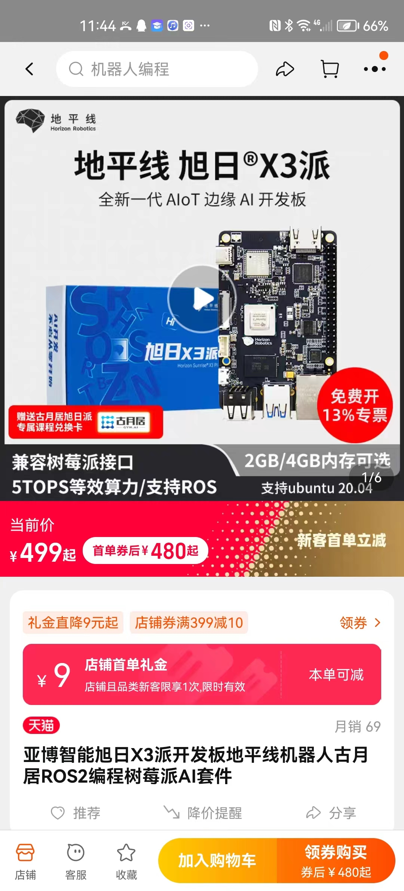
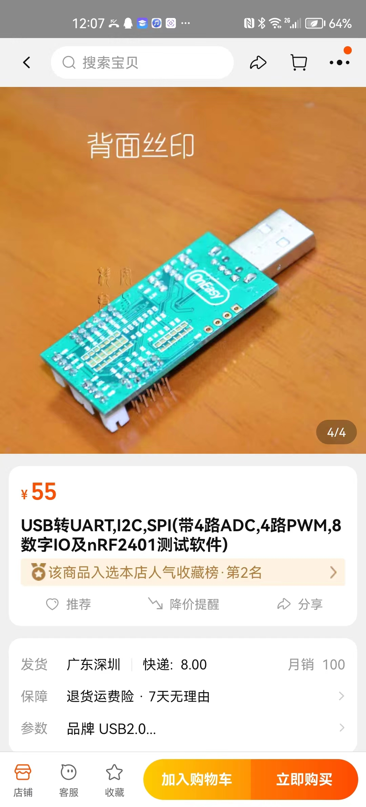

# 八期项目课程设计设想

## 一、控制方面

一是我们会推进这个ROS学习，具体的话，我们主要的学习不需要任何开发板或者说实际的硬件外设，所有的ROS学习都可以在电脑执行，至于说买上位机，一方面我们买过树莓派，但由于现在溢价过于离谱，经过多方面推荐的权衡，我们选择旭日X3派作为上位机的选型。定价在480元左右，多份购买大概率能够进一步优惠，当然这个的购买我们会通过验收他们的学习进度来判断是否去买这个上位机设备。而且这个设备到时候我们会统一回收，给之后的同学去使用。

我们对比一下如果用单片机是什么效果，如果上单片机的话，大家首先一定需要硬件来进行学习，而且学习强度跟ROS其实差不大多，开发板像是目前市面上最常用的，例如正点原子的STM32F1精英开发板加上st_link，售价在376元左右，而且在学习过程中一直需要使用硬件这也导致硬件的受损率会更高，更换的频率也更高。而且每个人都会去买，总的来说，花的钱其实更多。

综上所述，无论是从成本还是从整个一个学习过程和管理过程，目前用ROS的开发优点是要大大好于STM32的，而且能够帮助学院进一步发展ROS的相关技术，是意义重大的。

### 电机选型：

像我们之前一直都是用编码器电机，这样也导致一个后果就是，这些电机没办法很好地保留下来，很多之前的电机要不坏掉要不不见了，很难保留下来，我们在ROCOBON比赛中经常使用大疆的电机，因此在这一方面的保留会做得更好，像今年的ROBOCON比赛就需要大量的2006电机，但之前学院购置的数量有限，经常需要买新电机来补充，如果能够在大一就购置2006电机不仅可以传承下去，而且对于大二打ROBOCON比赛也会有更多的余地，不会像买编码器电机一样经常不见，难以保留下来。

## 二，硬件方面

这里硬件的同学除了要学习最基本的画图和选型工作外，还要能够写一定的代码来验证自己的想法。这个改变也是学院这么多期共同的共识，这样在开发硬件资源时才不会与之前电控的同学有过多的沟通成本，才会更容易地开发自己的硬件层。这里其实他们只要做一个USB转PWM的模块就可以实现功能（这部分建议八期的同学直接来抄师兄的电路板就可以了），对于之前熟悉STM32的同学来说，这个简单功能的代码量时完全够硬件的同学去学习的，希望电路的同学可以把更多的精力放在代码编辑上，难度并没有像之前画整个核心板以及外设的高。当然为了以防同学们无法按时完成这部分的开发，我们也进行了这部分的选型。

【淘宝】https://m.tb.cn/h.UJqHnsE?tk=xyROdQsTE0S CZ0001 「USB转UART,I2C,SPI(带4路ADC,4路PWM,8数字IO及nRF2401测试软件)」
点击链接直接打开 或者 淘宝搜索直接打开

## 两套方案的对比：（排除机械）

| 方案            | STM32                                             | 价格                                    | ROS                                                                               | 价格                                                           |
| ------------- | ------------------------------------------------- | ------------------------------------- |:--------------------------------------------------------------------------------- | ------------------------------------------------------------ |
| 主控            | 学习板：stm32f103精英版    比赛板                           | 学习板：376元                    比赛板： 200元 | 旭日X3                                    下层硬件：can   pwm           优点：易保留，而且RC比赛用的上 | 480        can 80  pwm  55                                   |
| 学习方式          | 需要配合硬件学习，一定要购买学习板                                 |                                       | 不需要配合实际硬件学习，大部分的学习在自己的电脑上完成。而且我们可以让两组共用一个ROS主控，因为接口简单，调试初参数不用在实车进行，所以这个可以实现。      |                                                              |
| 电机            | 选用普通编码器电机                   缺点：难保存，调参数困难，产品质量参差不齐 | 55元                                   | 选用2006电机                      优点：易保存，大厂出品，为下一年ROBOCON比赛做好准备                       | 260元                                                         |
| 硬件受损率         | 常用硬件调参，很容易坏，而且所用的硬件设备难以保留                         |                                       | 主要是在gazebo仿真调参，不需要频繁的硬件调参，硬件设备具有高度可复用性，硬件设备保留的难度更低                                |                                                              |
| 预估价格          | 这里的300元用来购置各种各样的小部件                               | 376+200+55*3+300=1041                 | 这里的100元主要用来购置舵机和声音模块                                                              | 2006方案480+80+260*3+100=1440  普通电机：                     1000元 |
| 可回收率          | 比赛板基本不可回收，电机和小部件基本不可回收。学习板可以进行回收                  | 回收率:33%                               | 主控板进行回收，2006电机进行回收，小部件回收困难                 若用普通电机，回收率在64.5%左右                     | 2006:回收率：87.5%             普通电机：64.5%                        |
| 评分（以资源浪费作为参照） | 697.47                                            | 1041-1041*0.33=697.47                 | 2006：1440-1440*0.875=180  普通电机：465                                                | 1440-1440*0.875=180         1000-480-55-55-55=465            |

整体来看，两套方案的预计价格其实差不大多，但是ROS的方案能够大大降低以往硬件设备复用性低的问题，下一届的同学在这个项目课中可以把更多的钱花费在刀刃上，不断完善我们这一门课的内容，达到人才培养以及落实相关技术革新的目的。
